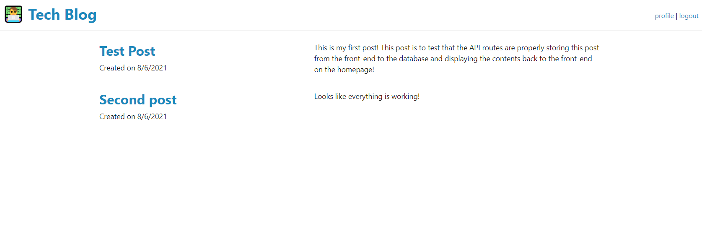

# Tech Blog

## Table of Contents

- [Description](#description)
- [Usage](#usage)
- [Screenshot](#screenshot)
- [License](#license)
- [Credits](#credits)
- [Questions](#questions)

## Description

This application is a blog web application. The application allows the user to sign up and login to their own account and create their own blog posts. The application uses the dotenv module to hide sensitive data such as the MySQL user, password, and the database, the Express module for setting up the server on localhost, the MySQL2 module to set up a connection to the local MySQL database, the Sequelize module for added ease of implementation for back end functionality pertaining to the MySQL database, the bcrypt module to encrypt the user's password, and other modules allowing for the use of sessions and the handlebars template.

## Usage

To use this application, the user would navigate to the deployed website and click on the login button on the top right. Then, the user would either login to the website if they have already created an account, or sign up for a new account if they have not yet created one. Once logged in, the user can then create a new blog post by giving it a title and a description. Once they have typed in their title and description, they will click the create button to create their blog post. To view their newly created post as well as all of their other posts and posts from other users, they can navigate to the homepage.

### Example of How to Use This Application

## License

This project is licensed under the [MIT License](https://opensource.org/licenses/MIT).

## Credits

This application was an assignment for the GA Tech Full Stack Web Development Coding Bootcamp. No starter code was provided for this assignment.

## Questions

If you have any questions about the repo, open an issue or contact me directly:

- Please contact me directly at my [GitHub](https://github.com/mcall0147)
- Or contact me by email at [mcallahanx93@gmail.com](mailto:mcallahanx93@gmail.com)
